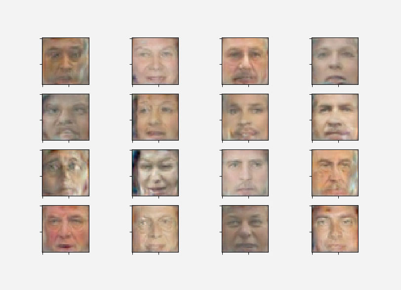

# FaceGAN
<h3>Generating images of human faces using GANs</h3>

Generative Adversarial Networks(GANs) are a class of artificial intelligence algorithms used in unsupervised machine learning, implemented by a system of two neural networks contesting with each other in a zero-sum game framework.

A GAN has two parts: <ul> 
  <li>a Generator which generates data, and</li>
  <li>a Discrimintor which differntiates between real and generated data.</li>
</ul>

<h4>Generator's goal is to fool the discriminator and Discriminator's goal is to not get fooled by the generator.</h4>
<h3>Sample Run</h3>

Run <b>main.py</b> and enter number of images to generate. One sample run yields the following

